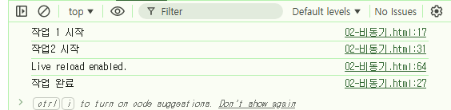
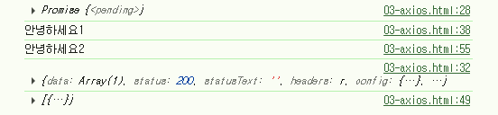
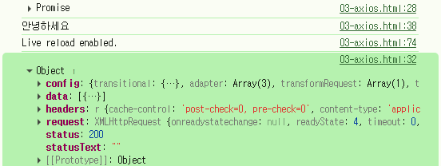

# 동기
## 동기란?
- 순차적으로 작업이 진행되는 것
- 작업이 끝날 때까지 기다림
- 
```html
<!DOCTYPE html>
<html lang="en">

<head>
  <meta charset="UTF-8">
  <meta name="viewport" content="width=device-width, initial-scale=1.0">
  <title>Document</title>
</head>

<body>
  <script>

    // 출력결과
    // 작업 1 시작
    console.log('작업 1 시작')
    // (반복 실행 동안 잠시 대기)
    // 작업 완료
    const syncTask = function () {
      for (let i = 0; i < 10000000000; i ++){
        // 대기
      }
      return '작업 완료'
    }

    console.result = syncTask() // 함수 호출
    console.log(result)
    // 작업 2 시작

     console.log('작업 2 시작')

    
  </script>
</body>

</html>

```
---
# 비동기
## 비동기란?
- 작업을 시작만 해두고 완료를 기다리지 않고 다음 코드를 진행하는 것

```html
<!-- asynchrounous.html -->

<!DOCTYPE html>
<html lang="en">

<head>
  <meta charset="UTF-8">
  <meta name="viewport" content="width=device-width, initial-scale=1.0">
  <title>Document</title>
</head>

<body>
  <script>

    // 출력결과
    // 작업 1 시작
    console.log('작업 1 시작');

    // 작업 완료 - 비동기 (콜백 함수)
    const asyncTask = function(callBack){
      setTimeout(() => {
        callBack('작업 완료')
      }, 5000)
    };

    asyncTask ((result) => {
      console.log(result)
    });

    // 작업 2 시작
    console.log('작업2 시작')
    
    // 작업 완료
    
  </script>
</body>

</html>

```
'


---
# Axios

AJAX의 주된 목적은 "새로고침 없이 비동기적으로 서버와 통신하기 위해서" 입니다.
Axios는 AJAX를 쉽게 사용하게 해주는 '라이브러리'입니다

## axios 사용할 수 있는 두 가지 방법
### 1. CDN
### 2. npm 라이브러리 설치


## Promise 활용 방법

### 1. Promise 객체를 변수에 할당하기
``` js
    const promiseObj = axios({
      // HTTP 메서드에는 대표적인 네가지 GET, POST, PUT, DELETE가 있다.
      // 지금은 get 요청을 보내서 고양이 사진을 가져올 참
      method: 'get',
      url: 'https://api.thecatapi.com/v1/images/search'
    }) 

```

### 2. Promise 객체를 변수 선언 없이 바로 처리
``` js
    // 2. 변수 선언 없이 Promise 객체를 바로 처리한다
    axios ({
      method: 'get',
      url : 'https://api.thecatapi.com/v1/images/search'
    })
      .then((response) =>{
        console.log(response.data)
      })
    .catch((error) => {
      console.log(error)
    })
    
    console.log('안녕하세요2')
```



### promise 핵심 정리

promise는 then | catch 만 외우면 된다
- .then() :  요청이 성공했을 때
- .catch() : 요청이 실패했을 때

```js
    promiseObj
      .then((response) => {
        console.log(response)
      })
      .catch((error) => {
        console.log(error)
      })

    console.log('안녕하세요')
    //  '안녕하세요'가 먼저 출력된다
    // console.log(response) ---> 서버에 get 요청 보내고, 응답이 도착했을 때 실행됨
    // '안녕하세요'가 나중에 출력되면 동기임.


```
- 이때는 안녕하세요가 먼저 출력된다.
- 