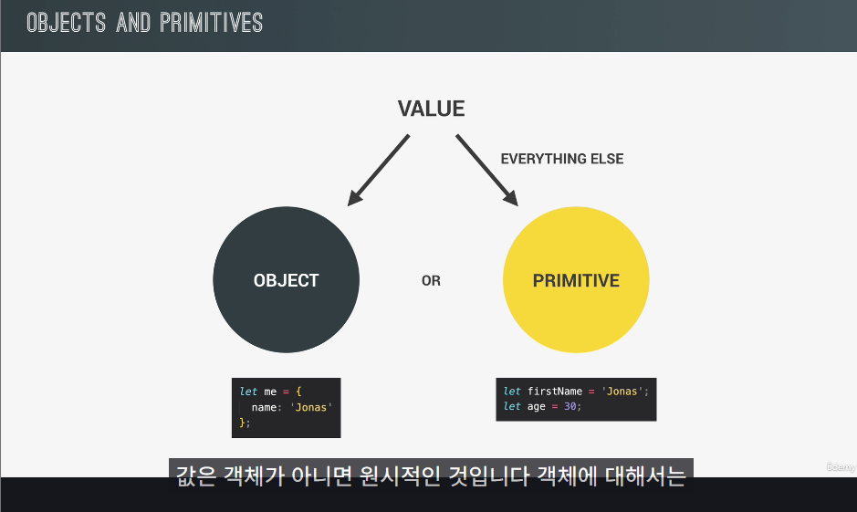

# 값과 변수
변수 생성 시 숫자와 문자 이외에 허락되는 기호는 달러와 밑줄 뿐이다.

# 데이터 타입

- JS에서 값은 객체가 아니면 원시적인 것임

## 원시 데이터 타입
### 1. 숫자 Number
부동 소수점 수 => 정의하지 않아도 늘 십진수를 갖고 있다는 뜻

### 2. 문자열 String
언제든 큰따옴표, 작은 따옴표를 넣어줌

### 3. Boolean
참 아니면 거짓 값만 가짐

지금까지 한 이 세가지가 가장 중요함

### 4. Undefined
우리가 선언한 변수 근데 이제 값을 할당하지는 않은...
값이 없다고도 볼 수 있음
```JavaScript
let children;
```

### 5. NULL
빈 값임. Undefined랑 살짝 비슷함

### 6. Symbol

### 7. Bigint

- JS는 동적 타이핑!
  - let으로 변수 선언한 후, 재할당할 때 let 앞에 안 붙여도 되는 거랑 똑같음

## 변수 선언
const 완전 지향
var 완전 지양

---
# 템플릿 리터럴
 백틱 씀

```Javascript
const jonas = "I'm" + firstName +', a' + (year - birthYear) + ' years old ' + job + '!';
console.log(jonas)

//템플릿 리터럴
const jonasNew = `I'm ${firstName}. a ${year - birthYear} year old ${job}!`;
console.log(jonasNew)
```

## 줄바꿈 방법
1. \n\
2. `` 백틱 안에 문장 넣고 그냥 줄 바꿔주기

```javascript
// 줄바꿈 방법 1)
console.log('String with \n\
      multiple \n\
      lines');

// 줄바꿈 방법 2)
console.log(`String
      multiple
      lines`);
```

---
# if-else

if () {

} else {

}
형식으로 적으면 됨

---
# Type Conversion & Type Coercion
자바스크립트에서는 세가지 유형으로만 변환이 가능함

1. 숫자
   - Number() 함수 씀
  
2. 문자열
   - String() 함수 씀
  
3. Boolean

## Type Coercion
자바스크립트에서 플러스 연산자는 문자열로 바꾸도록 유도함
   - 따라서 문자열 사이에 숫자 연산이 껴있을 때마다 숫자는 문자열로 변환됨