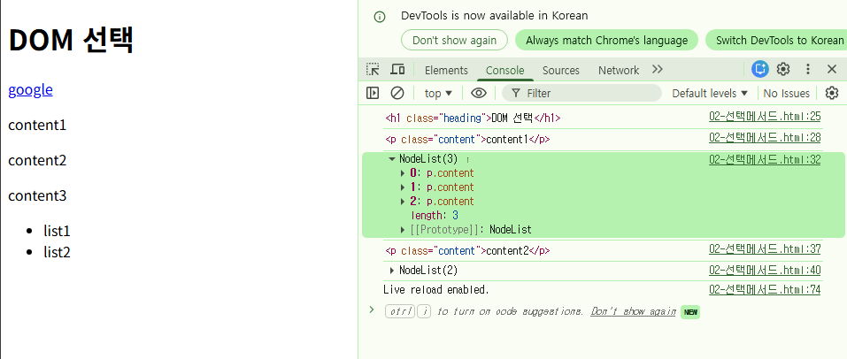
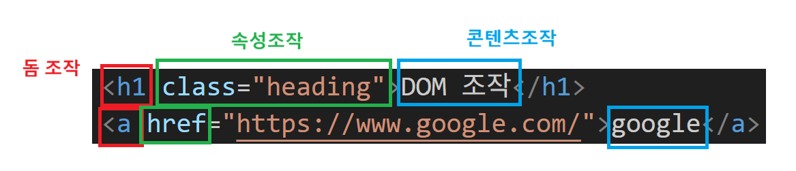

# JavaScript의 꽃, 비동기
위에서 아래로 순서대로 가지 않음
- 오래 걸리는 일이 있다면, 그 일이 끝날 때까지 기다리지 않고 일단 다음 일을 먼저 시작함
- 만약 자바스크립트가 모든 일을 동기적으로만 처리한다면, 인터넷에서 데이터를 가져오는 데 5초가 걸릴 때, 그 5초 동안은 웹페이지에 있는 다른 모든 기능들이 멈춤
  - 코드 실행 순서: 1 → 2 → 3
  - 2번 코드가 비동기(오래 걸리는 일)라면
  - 결과적인 실행 순서: 1 → 3 → 2(나중에 끝남)

# JS 변수 선언
## var, let, const 차이
var : 재할당 가능, 재선언 가능
let : 재할당 가능
const : 재할당 불가능, 재선언 불가능
### const를 쓰는 이유?
재할당, 재선언이 불가능하기 때문에 추적이 용이함

## 변수 선언 규칙
카멜케이스 : 단어와 단어를 붙일 때 첫 글자를 대문자로 씀
```JavaScript

let firstNumber = 10
firstNumber = 20

console.log(firstNumber)


const SecondNumber = 20
// SecondNumber = 10  const는 재할당 불가능, TypeError 뜸

console.log(SecondNumber)


a = 10
a = 20

b = 10
b = 30

console.log(a) // 디폴트는 var임
console.log(b) // 디폴트는 var임

```


# 선택 메서드
## 규칙
객체.메서드()
- 자바스크립트의 인덱싱은 키로 접근한다
- 

## 단일 선택 메서드
querySelector()

## 다중 선택 메서드
querySelectorAll()

```HTML
<!DOCTYPE html>
<html lang="ko">
<head>
  <meta charset="UTF-8">
  <meta name="viewport" content="width=device-width, initial-scale=1.0">
  <title>Document</title>
</head>
<body>
  <h1 class="heading">DOM 선택</h1>
  <a href="https://www.google.com/">google</a>
  <p class="content">content1</p>
  <p class="content">content2</p>
  <p class="content">content3</p>
  <ul>
    <li>list1</li>
    <li>list2</li>
  </ul>
  <script>
    // 단일 선택 메서드 : querySelector()
    // 다중 선택 메서드 : querySelectorAll()
    
    // 규칙 : 객체.메서드()`

    // 1. class가 'heading'인 요소를 선택하고 콘솔에 출력
    console.log(document.querySelector('.heading')) //class는 ., 아이디는 #
    
    // 2. class가 'content'인 요소를 선택하고 콘솔에 출력
    console.log(document.querySelector('.content'))

    // 3. class가 'content'인 모든 요소를 선택하고 콘솔에 출력
    // 3개의 <p> 요소가 NodeList 형태로 반환됨
    console.log(document.querySelectorAll('.content'))

    const items = document.querySelectorAll('.content')

    // 인덱싱 (key로 접근)
    console.log(items[1])

    // 4. <ul> 자식 태그인 모든 <li> 요소를 선택하고 콘솔에 출력
    console.log(document.querySelectorAll('ul > li'))

    // 이때 오른쪽 꺽쇠(>)는 자식태그라는 뜻
    
  </script>

</body>
</html>
```



---
# 속성 조작

- classList 메서드
  - add()
  - remove()
  - toggle()
    - 있으면 제거하고, 없으면 추가
  
- getAttribute() : 속성 값을 가져옴
- setAttribute() : 속성 값을 적용 (없으면 추가하고, 있으면 변경함)
- removeAttribute() : 속성을 제거

```HTML
<!DOCTYPE html>
<html lang="en">

<head>
  <meta charset="UTF-8">
  <meta name="viewport" content="width=device-width, initial-scale=1.0">
  <title>Document</title>
  <style>
    .red {
      color: crimson;
    }
  </style>
</head>
<body>
  <h1 class="heading">DOM 조작</h1>
  <a href="https://www.google.com/">google</a>
  <p class="content">content1</p>
  <p class="content">content2</p>
  <p class="content">content3</p>
  <ul>
    <li>list1</li>
    <li>list2</li>
  </ul>

  <script>

    // classList 메서드 : add(), remove(), toggle() (있으면 제거하고, 없으면 추가하고)


    // 1. h1Tag에 'red' 클래스를 추가
    h1Tag.classList.add('red')
    console.log(h1Tag.classList)

    
    // 2. h1Tag에서 'red' 클래스를 제거
    h1Tag.classList.remove('red')

    // 3. 클래스가 있으면 제거하고, 없으면 추가함
    h1Tag.classList.toggle('red')
    h1Tag.classList.toggle('red')

    console.log(h1Tag.classList) 


    // getAttribute() : 속성 값을 가져옴
    // setAttribute() : 속성 값을 적용 (없으면 추가하고, 있으면 변경함)
    // removeAttribute() : 속성을 제거

    const aTag = document.queryselector('a')
    console.log(aTag.getAttribute('href'))


    aTag.setAttribute('href', 'https://www.naver.com/')
    // 구글이 네이버로 변경이 될 것

    aTag.removeAttribute('href')
    console.log(aTag.getAttribute('href'))
    // NULL 값이 나올 것

  </script>

</body>

</html>
```