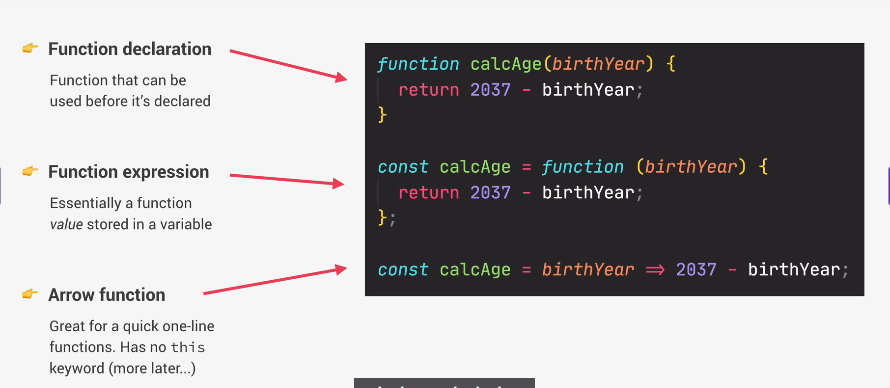
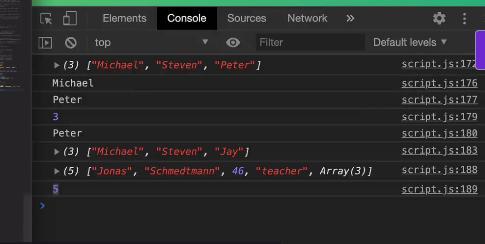

# 함수

- 함수 작성법 세가지를 보여줌

---
# 데이터 구조
- 변수를 저장해서 나중에 참조할 수 있게 도와주는 데이터 구조
- 가장 중요한 데이터 구조는 배열과 객체임

## 배열
- 동시에 여러 유형의 값을 담을 수 있음

```Javascript
// Array 만드는 첫번째 방법
const friends = ['Sam', 'Mike', 'John'];
console.log(friends);

// 두번째 방법
const years = new Array (1991, 1980, 2991, 1002);

// Array 접근법
console.log(friends[0])


// 여러 유형의 값을 담을 수 있는 배열
const firstName = 'Jonas';
const jonas = [firstName, 'Schmedtmann', 2037 -1991, 'teacher', friends];
console.log(jonas);
console.log(jonas.length);
```


# 배열과 내장함수
- 자바스크립트에 내장되어있는 함수는 배열에 직접적으로 적용 가능함
- 얘네를 메서드라고 하는데, 배열을 연산할 수 있음

## Add 메서드
### 1. push 메서드
- 배열 끝에 요소를 추가해줌
- 새 배열의 길이를 반환함

### 2. unshift 메서드
- 배열 맨 앞에 새로운 요소 추가해줌
- 새 배열의 길이를 반환함

## Remove 메서드
### 1.pop()
- 배열 맨 뒤 요소 제거
- 없어지는 요소 반환함

### 2. shift()
- 배열 맨 앞 요소 제거
- 없어지는 요소 반환함

## 위치 메서드
### 1. indexOf()
- 괄호 안의 요소가 배열의 몇번째에 있는지 확인
- 요소의 인덱스 반환함

### 2. includes()
- 괄호 안의 요소가 배열 안에 있는지 확인
- 있으면 참, 없으면 거짓 반환


```js

// push 메서드 : 배열 끝에 요소를 추가해줌
friends.push('Jay');

// unshift 메서드
friends.unshift('Bob');

//pop()
friends.pop();  
friends = pop();
console.log(friends);

// shift()
friends.shift();
console.log(friends);

// indexOf()
console.log(friends.indexOf('Mike'));
console.log(friends.indexOf('Bob'));

// includs()
console.log(friends.includes('Bob'));

if (friends.includes('Bob')){
  console.log('You have a friend called Bob.')
}
```
---
# 객체
- 키-값 쌍으로 이뤄짐
- 각각의 키는 속성이라고도 함
- 자바스크립트에서 가장 기본적인 개념임
- 객체를 작성하는 방법에는 여러가지고 있고,
- 아래가 그 예 중 하나임
- 
```js
const jonasSch = {
  fristName : 'Jonas',
  lastName : 'Schmedtmann',
  age : 2037 - 1991,
  job : 'teacher',
  friends: ['Bob', 'Sam', 'John']
};
```

## 객체와 배열의 차이
- 객체는 값의 순서가 없음
- 배열은 인덱스를 통해 접근하는데, 객체는 키를 통해 접근함