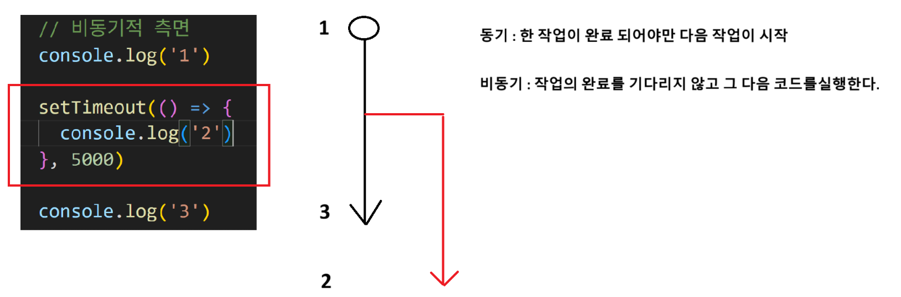

# 객체
## 객체 내장 함수
```html
<!DOCTYPE html>
<html lang="en">

<head>
  <meta charset="UTF-8">
  <meta name="viewport" content="width=device-width, initial-scale=1.0">
  <title>Document</title>
</head>

<body>
  <script>
    const user = {
      name: 'Alice',
      'key with space': true,
      greeting: function () {
        return 'hello'
      }
    }

    // 조회 두가지 방법
    // 1. 개체.속성
    console.log(user.name)

    // 2. 만약 속성이 (문자열, 특수문자포함, 숫자로 시작)
    // 2. 객체['속성']
    console.log(user['key with space'])

    // 추가
    user.address = 'busan'
    console.log(user.address)


    // 수정
    user.name = 'bogeom'
    console.log(user.name)

    // 삭제 --> delete
    delete user.name
    console.log(user.name) // undefined

    // in 연산자 (파이썬의 멤버십 연산자와 비슷함)
    console.log('greeting' in user)  // 불리언 값으로 출력됨
    console.log('country' in user)

    // 메서드 호출 (객체 안에 있는 함수를 메서드라고 함)
    console.log(user.greeting)

    //this 키워드를 사용


  </script>
</body>

</html>


```
---

# 추가 객체 문법
## 단축 속성
## 단축메서드
## 계산된 속성
## 구조 분해 할당

### 구조 분해 할당이 쓰이는 두 가지 경우
1. 변수에 객체의 값을 할당할 때
- 중괄호 {} 사용하면 됨

2. 함수의 매개변수로 쓰일 때
- 특징 1) 매개 변수 순서가 상관없다
- 특징 2) 인자가 없으면 undefined

## 전개 구문

## 유용한 객체 메서드

- 속성 : Objects.keys
- 값 : Objects.values

그럼 속상이랑 값만 좌라락 나옴

---
# Optional Chaining
## Optional Chaining의 목적
중첩 객체에 접근하여 에러 발생 없이 값을 가져오기 위함

### 그런데 객체값이 없는데 접근하려고 하면?
에러가 뜨는데, 우리가 원하는 건 undefined

이때 주의해야할 점은, optional-chaining 사용 시 처음에 쓰지 않아야 함.

```js
    const user = {
      name: 'Alice',
      greeting: function () {
        return 'hello'
      }
    }

    // optional-chaining의 목적?
    // 중첩된 객체에 접근하여 값을 가져오려고 하기 때문임
    // 없는 객체에 접근해서 하려 하면 error뜸. 근데 우리가 원하는 건 undefined임

    // console.log(user.address.street) 이거 에러 뜨는데, 에러 안 떴으면 좋곘음

    // 이때 옵셔널 체이닝 사용
    console.log(user.address?.street)

    
    // 나쁜 예시
    // 시작 값에 optional-chaining을 쓰는 경우
    console.log(user?.address.street) // error 발생
```


## json 변환
프론트엔드에서 json을 써먹으려면 객체로 바꿔야 함
- 파이썬에서는 json이 dictionary로 나타났지만,
- JavaScript에서는 json이 object(객체)로 나타남

### 두 가지 외워야할 포인트
1. 객체를 json으로 변환하는 메서드 : JSON.stringify()
2. json을 객체로 변환 : JSON.parse()


### json vs 객체
- json은 키가 문자열, 다 큰 따옴표로 나옴

---
# 배열과 배열 메서드
===
# 콜백함수
- 함수의 인자로 들어가는 함수를 콜백함수라 한다
- 콜백함수를 쓸 때는 무조건 화살표 함수로 써준다.
- 자바스크립트의 꽃인 비동기를 할 때 콜백 함수를 쓴다.

## 정리
함수의 인자로 들어가는 함수가 콜백함수다. 그리고 주로 화살표 함수로 콜백 함수를 나타낸다.

---
# forEach
```js
    const names = ['Alice', 'Bella', 'Cathy']

    // 파이썬에서는
    // for name in names:
    //   print(name)

    // 1. 일반 함수 표기
    names.forEach(function (name) {
      console.log(name);
    });

    // 2. 화살표 함수 표기
    names.forEach(name => console.log(name));

    // forEach의 콜백함수는 3개의 매개변수를 받을 수 있다.
    // 1. 현재 요소의 값(value)
    // 2. 현재 요소의 속성(인덱스)
    // 3. 배열 전체

    names.forEach( function( name, index, arr) {
      console.log(`${name} / ${index} / ${arr} `)
    })

```
# 배열과 스프레드 연산자
복사본이 변경되면 원본도 변경될까?


---
# map
## map vs forEach
- map 함수는 새로운 배열을 반환함.
  - return 필요;


---
# 비동기 통신
## 비동기 통신을 다루는 세가지 방식
1. 콜백
2. Promise
3. async / await


## 콜백
```js
    // 비동기적 측면
    console.log('1');

    setTimeout(() => {
      console.log('2')
    }, 5000); // 5초 뒤에 나옴


    console.log('3');
    
    // 출력 결과
    // 1
    // 3
    // 2
```



# 내장함수
## map(), filter(), forEach()

```js
const numbers1 =[1, 2, 3, 4];
const doubled = numbers.map(number => number * 2);

console.log(doubled); // [2, 4, 6, 8]
console.log(numbers) // [1, 2, 3, 4]

//filter
const numbers2 = [1, 2, 3, 4, 5, 6];
const evens = numbers.2.filter(number => numbers % 2 === 0);

console.log(evens): // [2, 4, 6] 새로운 배열 출력

//forEach
// 반환 값 없이 반복 작업만 수행

const fruits = ['apple', 'banana', 'grape'];

fruits.forEach(fruit => {console.log(`내가 좋아하는 과일은 ${fruit}입니다.`)})
```
