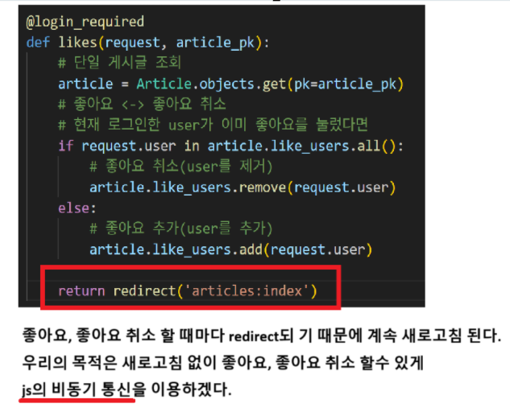

# 흐름
문제 

## 1. 앱의 views.py 수정
```py
from django.http import JsonResponse


@login_required
def likes(request, article_pk):
    # 단일 게시글 조회
    article = Article.objects.get(pk=article_pk)
    # 좋아요 <-> 좋아요 취소
    # 현재 로그인한 user가 이미 좋아요를 눌렀다면
    if request.user in article.like_users.all():
        # 좋아요 취소(user를 제거)
        article.like_users.remove(request.user)
        is_liked = False
    else:
        # 좋아요 추가(user를 추가)
        article.like_users.add(request.user)
        is_liked = True

    context = {
        'is_liked': is_liked
    }
    return JsonResponse(context)
```

## 2. 템플릿의 index 수정
```html
# articles > templates > articles > index.html
         자바 스크립트에서 쓰기 위해 id 값 추가해야함 
        <form action="" method="POST" data-article-id="{{article.pk}}">
            
             좋아요 이미 눌렀으면 -> 좋아요 취소 
            
                <input type="submit" value="좋아요 취소" id="like-{{article.pk}}">
              좋아요 안 눌렀으면 -> 좋아요 
                <input type="submit" value="좋아요">
            

        </form> 좋아요 안 눌렀으면 -> 좋아요 

```
---
## 3. 템플릿 전체 수정
```html






    <h1>게시판</h1>

     사용자가 인증 되어 있을 때(로그인 되어 있을 떄) 
    
    
      <h3>안녕하세요. {{user.username}}</h3>

      <a href="">내 프로필</a>

       GET 요청 
      <a href="">회원 정보 수정</a>

       POST 요청 
      <form action="" method = "POST">
          
          <input type="submit" value="회원탈퇴">
      </form>
    
       POST요청 
      <form action="" method="POST">
        
        <input type="submit" value="로그아웃">
        </form>

    <hr>
        <a href="">글쓰기</a>
    <hr>

    

     GET 요청 
    <a href="">회원 가입</a>

     GET요청 
    <a href=""> 로그인 </a>


    

    <article class = "article-container">


     DTL : for문 
    
         {{객체.속성}} 
        <p>작성자 : 
            <a href="">
                {{article.user}}
            </a>
        </p>

        <p>글 id : {{article.pk}}</p>

        <a href="">
            <p>글 제목 : {{article.title}}</p>
        </a>

        <p>글 내용 : {{article.content}}</p>
        
         자바 스크립트에서 쓰기 위해 id 값 추가해야함 
        <form action="" method="POST" data-article-id="{{article.pk}}">
            
             좋아요 이미 눌렀으면 -> 좋아요 취소 
            
                <input type="submit" value="좋아요 취소" id="like-{{article.pk}}">
              좋아요 안 눌렀으면 -> 좋아요 
                <input type="submit" value="좋아요" id="like-{{article.pk}}">
            

        </form> 좋아요 안 눌렀으면 -> 좋아요 

         <p>글 생성 시간 : {{article.created_at}}</p> 
        <hr>
        
        </article>
     axios를 쓰기 위해서는 cdn을 먼저 가져와야 한다 
    <script src="https://cdn.jsdelivr.net/npm/axios/dist/axios.min.js"></script>

    <script>
        // 1. querySelector ( 가져오기 )
        const articleContainer = document.querySelector('.article-container')
        const csrftoken = document.querySelector('[name=csrfmiddlewaretoken]').value
        console.log(articleContainer)
    
        // 2. callback 함수 + 3. 이벤트 리스너
    
        articleContainer.addEventListener('submit', function (event){
            // submit 시 새로고침 방지
            event.preventDefault() 
            const articleId = event.target.dataset.articleId
    
            axios({
                method: 'post',
                url: `/articles/${articleId}/likes/`,
                // Django 공식문서 출신
                headers: {'X-CSRFToken': csrftoken},
            }) .then ((response) => {
                const isLiked = response.data.is_liked
                const likeBtn = document.querySelector(`#like-${articleId}`)
                if (isLiked === true){
                  likeBtn.value = "좋아요 취소"
                } else{
                  likeBtn.value = "좋아요"
                }
                console.log(response)
            }) .catch((error) =>{
                console.log(error) 
            })
        })
    
    
    
    </script>
    
</article>

```

---
# follow 흐름
## 1. CRUD의 views.py 수정
```py
from django.http import JsonResponse
@login_required
def follow(request, user_pk):
    User = get_user_model()
    # person : user_pk로 팔로우 하려는 상대방
    person = User.objects.get(pk=user_pk)
    # 자기자신을 팔로우 하는것을 방지
    if person != request.user:
        # 로그인한 사용자가 이미 팔로잉을 하고있는지 확인
        # person.followers : 역참조
        if person.followers.filter(pk=request.user.pk).exists():
            # 팔로우 취소
            person.followers.remove(request.user)
            is_followed = False
        else:
            # 팔로잉
            person.followers.add(request.user)
            is_followed = True

        context = {
            'is_followed' : is_followed,
            'followings_count' : person.followings.count(),
            'followers_count' : person.followers.count()
        }
        return JsonResponse(context)   
    
    # 보안 상 자기 자신을 follow하면 리다이렉트 시키기
    return redirect('accounts:profile', person.username)
```