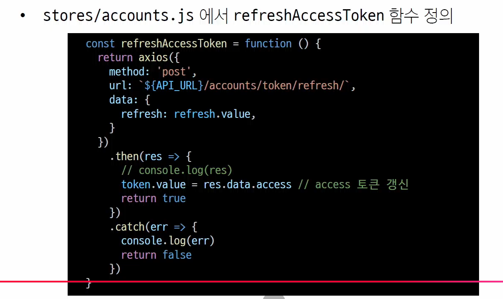

# jwt 설치 과정
1. 가상환경 만들기
### backend
```bash
python -m venv venv 
source venv/Scripts/Activate


pip install -r requirements.txt
pip install djangorestframework-simplejwt

```


2. settings.py 가서 설정 변경하기

- 기존에는 token authetication이라고 되어있는데,
밑에 있는 rest_framework_simplejwt...  JWTAuthentication 주석 해제해주기

- rest_framework_simplejwt 주석해제하기

- REST_AUTH(dj-rest-auth)의 login url을 그대로 활용하기 위해 USE_JWT을 True로 변경하기

3. migrate하기
```bash
python manage.py makamigrations
python manage.py migrate
python manage.py runserver
```
하고 runserver하기


### frontend

4.
```bash
npm i
npm run dev
```

5. 회원가입 진행하기
f12의 application 들어가서 Local storage누르고, http://... 이거 clear하기


그러면 undefined가 뜰 것임. 왜 undefined가 뜰까?
URL이 환경변수에 담겨있는데, 지금 공유할 때 .gitignore에서 걸러졌기 때문.

따라서 frontend에 .env.loca을 만들어주고, VITE_API_URL = 'http://127.0.0.1:8000'를 넣어준다.

- 환경변수 넣으면 서버 항상 재 시작해줘야함(안 그러면 인식을 못 함)
- 재시작하고 다시 signup하기
- 그런데 회원가입 페이지에서 로그인을 하면, 로그인이 필요하다고 뜰 것임.
    - 지금 기존의 코드는 token방식으로 작성되어있는데, jwt로 로그인하는 것이다보니 정상적으로 로그인이 안 되는 것처럼 나온다.
    - 그냥 signup 페이지로 이동해서 로그인하면 됨

- signup 페이지에서 로그인하고 콘솔을 열면, access가 뜸
    - 어제까지는 key라는 이름으로 전달됐는데, 이제는 access로 전달됨
    - 기존에 있던 key를 access로 수정해야함.

6. access로 수정하기
sotores.accounts.js에서 보면 
logIn파트에서 token.value =res.data.key는 주석처리 해주고, 아래의 res.data.access를 주석해제해야함.

7. jwt 확인하기
이제 다시 로그인하면 로그인 후 페이지로 잘 넘어갈 것임. 토큰이 잘 저장되었다는 뜻

번외로, console의 access 부분의 값을 저장하고,
jwt.io에 따옴표 제외해서 넣으면 jwt가 담고 있는 정보를 볼 수 있다.
- JWT decoder라는 패키지가 있는데, 그걸 쓰면 안에 담긴 정보까지 다 볼 수 있다.


- 그리고 칸에 보면 secret key가 있는데, 그걸 입력하면 내 jwt와 일치하는지 보안 점검이 가능하다
- 이 key는 settings.py에 있는데, 이걸 다룰 때는 무척 조심해야함.
- 배포나 공유 시에는 싹 지우고 보내야함 (환경 변수에 아마 저장하는 듯/ 추후 확인 필요)


---
# 게시글 조회 및 생성
토큰을 잘 받고 저장까지 잘 했는데, 401 에러가 뜬다. (인증이 잘 안된다는 뜻)
- => 공식문서를 보면 토큰에 Bearer를 붙여주면 된다고 나온다.

## frontend
1. stores>articles.js

여기서 getArticles 함수에서
```js
Authroization : `Token ${accountStore.token}`
```
에서
```js
Authroization : `Bearer ${accountStore.token}`
```
로 바꿔주어야 함


또한, views> CreateView.vue에서
headers를
```vue
headers: {
    'Authorizaiton': `Bearer ${accountStore.token}`
}
```
로 해주어야함.

이렇게 하고 로그인하면 404에러가 뜰 텐데, 이건 게시글이 없어서 그런 것이니 놀라지 말 것.
게시글만 create 해주면 해결 된다.

---

# refresh token 실습
지금 상태는 refresh toekn이 빈값으로 저장되어 있는 상태. ( refresh: "")
이건 왜냐면 refresh_token이 보내지지 않는 것이 기본값인 JWT_AUTH_HTTPONLY가 TURE라고 되어있기 때문이다.

## backend
1. my_api>settings.py
```py
REST_AUTH={
    ...
    'JWT_AUTH_HTTPONLY' : False
}
```
로 바꿔주기

그러고 콘솔 창을 열면 refresh token이 발급되었음을 확인가능.

2. 로그인 시 발급받은 refresh token 저장ㅎ
## frontend
stores>accounts.js
```js

// logIn 상수에 들어가서 변경
user.value = res.data.user
refresh.value = res.data.refresh
```
주석해제

그러고 vue에 들어가서 pinia를 열어보면, account에 Token 밖에 없다.
refresh token이 저장이 안 된 상태
refresh token도 저장이 되게끔

stores>accounts.js에 들어가서
```js
const userAccountStore = ...
const refresh = ref(null)
const user = ref(null)
```
주석해제 해주고, return을 안 해줘서 저장이 안되기도 하니까
```js
user,
refresh

```
return 안에 넣어주기

그럼 이제 pinia에서 확인해보면, refresh token도 담겨있다.

## token 만료 기한 설정
- 현재 access token은 5분, refresh token은 1일로 만료기한이 설정되어 이씅ㅁ
- access token의 경우 적정 만료 기한이
    - 짧을 수록 보안에 유리함
    - 그대신, 너무 짧으면 갱신 요청이 많아짐
    - 대부분의 서비스는 10 - 15분으로 설정
        - 다만, 보안에 민감한 금융권 같은 경우는 5 - 10분으로 설정

- refresh token의 경우 적정 만료 기한이
    - 일반적으로 1-2주, 또는 30일을 주로 사용함
    - 보안이 안전한 곳에서는 30- 90일까지도 사용함 (개인 PC)
        - 보안에 민감한 경우 1-14일로 설정

### backend
my_api > settings.py
```py
SIMEPLE_JWT = {
    'ACCESS_TOKEN_LIFETIME': timedelta(minutes=1),
    'REFRESH_TOKEN_LIFETIME' : timedelta(minutes=2),
}
```
공식 홈페이지에 다 ~~ 나와있음

4. refresh tooken을 활용한 access token갱신
stores/accoutns.js에서 refreshAccessToken 함수 정의


그리고 return에서
refreshAccessToken도 주석해제(넣어줄 것)
---
# Article 목록 요청 시 access toekn 재발급
- 요청에 실패한 경우 catch 메서드 실행됨
- 요청 실패의 원인이 401 (Unauthorized)인 경우
    - refreshAccessToken 함수를 실행하여 access token을 재발급
        - a. access token 재발급 성공 시
            - Article 목록 다시 요청하여 목록 받아옴

        - b. 재발급 실패 시
            - refresh token이 만료됨을 의미 
            - 모든 인증 정보를 삭제한 후 로그인 페이지로 이동

- 이 흐름을 catch 함수 작성해주기\

### frontend
5. stores>articles.js
```js
.catch(err->{

    console.log(err)

    if (err.response?.status === 401){ // 에러가 401인지 확인
        console.log('Access Token 재발급 진행!')

        // access token 재발급은 비동기 요청
        accountStore.refreshAccessToken()
        .then(ok ->{
            // 재발급에 실패한 경우 종료
            if (!ok){
                window.alert('다시 로그인이 필요합니다.')
                accountStore.logOut() // 기존에 저장된 token을 제거하기 위함
                router.push({ name : 'LogInView' })
                return
            }
            // 재발급에 성공한 경우 재요청 진행
            axios({
                method : 'get',
                url : `${API_URL}/api/v1/articles/`,
                headers: {
                    'Authorization': `Bearer ${accountStore.token}`
                },
            })
            .then(res => {
                articles.value = res.data
            })
        }
        )
    }
})

// .catch는 안 적혀있으므로 다시 하면 좋을 듯.
// 그리고 async await로 적으면 더 간단히 적을 수 있으니 참고하기
```


6. views> CreateView.vue도 동일한 로직으로 적어주기
```js
  const createArticle = function () {
    axios({
      method: 'post',
      url: `${store.API_URL}/api/v1/articles/`,
      data: {
        title: title.value,
        content: content.value
      },
      headers: {
        'Authorization': `Token ${accountStore.token}`
        // 'Authorization': `Bearer ${accountStore.token}`
      },
    })        
      .then(res => {
        router.push({ name: 'ArticleView' })
      })
      .catch(err =>{
        console.log(err)

        if (err.response?.status === 401) {
          console.log('Access Token 재발급 진행!')
          
          // access token 재발급은 비동기 요청
          accountStore.refreshAccessToken()
            .then(ok => {
              // 재발급에 실패한 경우 종료
              if (!ok) {
                window.alert('다시 로그인이 필요합니다.')
                accountStore.logOut()   // 기존에 저장된 token을 제거하기 위함
                router.push({ name: 'LogInView' })
                return 
              }
              // 재발급에 성공한 경우 재요청 진행
              axios({
                method: 'post',
                url: `${API_URL}/api/v1/articles/`,
                headers: {
                  'Authorization': `Bearer ${accountStore.token}`
                },
                data: {
                  title: title.value,
                  content: content.value
                },
              })
                .then(res => {
                  router.push({ name: 'ArticleView' })
                })
              })
          }
      })
  }
  ```

  - axios의 intercept도 사용가능한데, 공식문서를 읽어보고 구현해보면 좋음.

  ---

# 위치 기반 지도 검색 기능 구현
Geolocation API
- 사용자의 현재 위치 정보를 브라우저를 통해 간편하게 얻을 수 있는 인터페이스
- 

